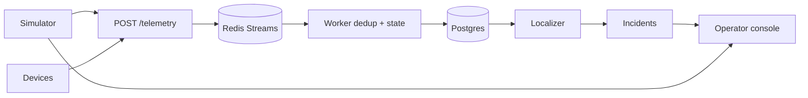

# ARCHITECTURE

Stack: **FastAPI + Redis Streams + PostgreSQL + React/Vite + Docker Compose**.

Goal: noisy pole live/dark telemetry → one trustworthy localized incident → telemetry-verified close.

---

## Data flow

Simulator and devices share the same ingest path. The API never runs localization inside the HTTP request.

Production note: devices would publish NB-IoT → MQTT → bridge into this same stream. This assignment uses HTTPS for simplicity.

---

## Ingestion

- `POST /telemetry` validates the payload, `XADD`s to Redis, returns **202**.
- Worker uses `(device_id, seq)` for dedup and per-device order.
- Device clocks skew ±90s — global ordering uses **server receive time**, not `ts`.
- Firmware 1.2.x never sends `power_lost`; silence after missed heartbeats is the loss signal.
- Late retries (hours later) are ignored when `seq` is stale.

---

## Storage and topology

| Table | Role |
|-------|------|
| `feeders` / `distribution_transformers` / `poles` | Asset registry |
| `pole_states` | Current energized belief per pole |
| `incidents` | Tickets + confidence + reasons |
| `scheduled_outages` | Soft suppress signal |
| `processed_events` | Dedup ledger |

Each pole has:

- `parent_id` — tree the **localizer** walks (recorded or geo-inferred)
- `true_parent_id` — ground truth for the **simulator** when wiring was inferred
- `topology_source` — `recorded` | `inferred` | `none`

Adjacency is cached in memory per DT (`topo_index`).

**Missing topology (~60% DTs):** registry parents cleared at seed; parents inferred by growing a tree from the DT using nearest-neighbour geography. UI and confidence show inferred mode. If the pattern is whole-DT dark, we report a DT fault instead of inventing a fake span.

---

## Localization algorithm

Sensors are nodes. Faults are edges. Find the live→dark frontier on the radial tree.

1. Debounce dirty DTs (~`DETECT_WAIT_SEC`, default 30s) so sibling reports can arrive.
2. Soft-check scheduled outages (never hard-block — feeds are late/cancelled).
3. Sensor lie: dark pole with live descendants → no outage ticket.
4. Classify:
   - all DTs on a feeder dark → `feeder`
   - whole DT dark → `dt`
   - otherwise → `span` at last live parent → first dark child
5. Group all dark poles that share the same frontier into **one** incident.
6. Two frontiers on the same DT → two incidents.
7. Confidence is deterministic (wiring known?, missing devices?, class). Reasons are stored as structured evidence.
8. PIN: pole registry, else nearest pole with a PIN.

Complexity: O(n) per dirty DT (n ≤ ~240 poles). Failure modes: wrong geo-infer parent on dense layouts; debounce delay; partial device coverage on the true boundary.

---

## Noise / trust

| Signal | Action |
|--------|--------|
| Duplicate / stale seq | Drop |
| Isolated dark, children live | Sensor failure |
| Schedule + matching scope | Soft suppress |
| Unexpected dark shape during schedule | Still ticket |

---

## Ticket lifecycle

`detected → acknowledged → crew_assigned → resolved → verified → closed`

Resolve while poles are still dark → rejected / verify note. Restoration comes from `power_restored` / live heartbeats, not the button.

---

## API surface

| Method | Path | Purpose |
|--------|------|---------|
| GET | `/health` | Liveness |
| GET | `/health/ready` | DB check |
| POST | `/telemetry` | Ingest device event |
| GET | `/network/summary` | Seeded network counts |
| GET | `/network/dts` | DT list |
| GET | `/network/dts/{id}` | Poles + state for a DT |
| GET | `/breadcrumb/dt/{id}` | Upstream path hint |
| GET | `/incidents` | Incident list |
| POST | `/incidents/{id}/acknowledge` | Ack |
| POST | `/incidents/{id}/assign_crew` | Assign stub crew |
| POST | `/incidents/{id}/resolve` | Operator claims fixed |
| POST | `/incidents/{id}/explain` | Grounded summary |
| POST | `/sim/inject` | Inject span/dt/feeder fault |
| POST | `/sim/repair` | Emit restore telemetry |
| POST | `/sim/noise` | Dead sensor / dup / reorder |
| POST | `/sim/scenario` | Packaged demo scenario |

OpenAPI: `/docs` (generated by FastAPI).

---

## Operator UI

First glance: open incidents (what / where / confidence). Map and detail second. Simulator controls on the same screen for reviewers.

Deliberately omitted: auth, crew routing, analytics charts, per-pole alert floods.

Realtime: short polling (avoids WebSocket proxy pain on free hosts).

---

## AI feature

**Grounded incident explanation** on `POST /incidents/{id}/explain`.

- Inputs: structured incident fields + reasons only.
- Prefers Groq, then OpenAI; if no key or call fails → deterministic paragraph from the same facts.
- Not used for localization, confidence, or grouping.

Cost: one short chat completion per explain click. Unavailable model ⇒ UI still fully usable.
