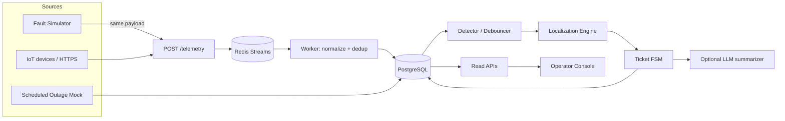

# ARCHITECTURE — Intelligent Fault Localization Platform

**Role of this document:** Staff-engineer design you can defend line-by-line in a senior backend / product interview.  
**Stack decision:** FastAPI + Redis Streams + PostgreSQL + React/Vite + Leaflet + Docker Compose.  
**North star:** Unreliable node telemetry → one trustworthy edge incident → operator action in < 2 minutes.

---

## 0. First principles (pehle yeh clear karo)

### 0.1 What the software *is*

A **closed-loop incident system**:

```
physical fault → noisy IoT signals → inferred edge failure → ticket → crew work
                                                              ↓
                                              poles live again (measured) → verify → close
```

Software ends at **verified location + verified restoration**. Crew routing is out of scope.

### 0.2 What the software is *not*

- Not a chatbot.
- Not an ML prediction product.
- Not “alert on every dark pole.”
- Not a microservices showcase.

### 0.3 The CS problem in one line

**Sensors observe nodes. Faults live on edges. Infer the live→dark frontier on a radial tree.**

```
DT ── P1(live) ── P2(live) ──╳── P3(dark) ── P4(dark)
                              ↑
                         fault = edge(P2,P3)
```

### 0.4 The honesty rule

> Never pretend to know more than the data supports.

If topology is missing → say so, lower confidence, degrade localization grain (span → candidate span range → DT).  
Fake precision destroys operator trust faster than a coarse-but-true answer.

### 0.5 Scale reality check (architecture depends on this)

| Fact | Implication |
|------|-------------|
| ~38k poles / subdivision | Graph fits in memory. Correctness ≫ distributed scale. |
| ~39 msg/s steady | A single API process + Redis buffer is enough. |
| 5k msgs / 10s burst | Need a queue so HTTP ingest never does localization inline. |
| 12–120 outages/day | Incident rate is tiny. Localization CPU is cheap. |

**Verdict:** One backend service. Redis for absorb + debounce. Postgres for truth. No Kafka. No k8s. No mesh.

---

## 1. Layered view

```
┌─────────────────────────────────────────────────────────────┐
│ PRODUCT LAYER                                               │
│  Operator trusts one incident per fault; drives to a span   │
├─────────────────────────────────────────────────────────────┤
│ BUSINESS LAYER                                              │
│  Detect → Localize → Ticket → Verify restore → Close        │
│  Suppress: sensor lie, schedule, silence-without-evidence   │
├─────────────────────────────────────────────────────────────┤
│ SYSTEM LAYER                                                │
│  Ingest | State | Detect | Localize | Tickets | Console     │
│  Simulator (same ingest path as “real” devices)             │
├─────────────────────────────────────────────────────────────┤
│ COMPONENT LAYER                                             │
│  Telemetry API, Stream consumer, Topology service,          │
│  Localization engine, Noise filters, Ticket FSM,            │
│  Summarizer (LLM), Simulator, Geocode helper                │
├─────────────────────────────────────────────────────────────┤
│ API LAYER                                                   │
│  POST /telemetry  ·  tickets CRUD/actions  ·  sim inject    │
│  GET network/incidents (poll or SSE)                        │
├─────────────────────────────────────────────────────────────┤
│ DATABASE LAYER                                              │
│  poles, dts, topology_edges, device_state, events,          │
│  incidents, tickets, scheduled_outages                      │
├─────────────────────────────────────────────────────────────┤
│ ALGORITHM LAYER                                             │
│  Dedup/order · silence timer · cluster · frontier · conf    │
├─────────────────────────────────────────────────────────────┤
│ INFRA / DEPLOY                                              │
│  docker compose: api, worker, redis, postgres, web          │
│  Public URL: Railway/Render/Fly                             │
└─────────────────────────────────────────────────────────────┘
```

**Hinglish summary:** Product bola “2 hours → 2 minutes.” Business bola “ek fault = ek ticket, verify telemetry se.” System usko ingest→localize→ticket banata hai. Algorithm tree pe frontier dhundhta hai. Infra sirf itna complex jitna burst handle kar sake.

---

## 2. End-to-end data flow



**Critical product invariant:** Simulator and “real” devices share **one ingest contract**. Backend must not special-case simulator packets. Simulator = integration test harness that proves physics understanding.

---

## 3. Component catalog

For each component: why it exists, alternatives, interactions, failures, complexity, scale, future, interview angles.

---

### 3.1 Telemetry Ingest API (`POST /telemetry`)

**1. Why exists?** Only doorway from physical world (or simulator) into software.  
**2. Why needed?** Devices push; we cannot pull NB-IoT devices. Assignment contract is HTTPS.  
**3. Alternatives:** MQTT broker in-compose; sync localization inside request; Kafka topic.  
**4. Reject:** MQTT adds ops for little demo value (document how prod would swap). Sync localization fails burst SLO. Kafka overkill at 39 msg/s.  
**5. Interactions:** Validates payload → enqueues to Redis → returns 202 fast. Never runs localization in request path.  
**6. Failures:** Malformed JSON → 400. Redis down → 503 + retry-friendly. Duplicate POSTs → OK (idempotent downstream).  
**7. Time:** O(1) validate + enqueue.  
**8. Space:** O(1) per request.  
**9. Scale:** Horizontal replicas OK; Redis is the buffer. Target ≥500 msg/s sustained.  
**10. Future:** MQTT bridge service in front; mTLS; device auth.  
**11. Interview:** “Why 202 not 200?” — because accept ≠ processed. “Where do you drop under overload?” — Redis maxlen / consumer lag alert, never silently lose without metric.

---

### 3.2 Redis Streams (ingest buffer)

**1. Why exists?** Burst sponge + decoupling.  
**2. Why needed?** 5,000 messages in 10s after feeder fault; HTTP workers must not block on graph work.  
**3. Alternatives:** Postgres `LISTEN/NOTIFY`; in-process asyncio queue; RabbitMQ; Kafka.  
**4. Reject:** In-process dies with process (compose restart loses in-flight). Postgres as queue fights OLTP. Rabbit fine but Redis already needed for debounce keys. Kafka unjustified.  
**5. Interactions:** Producer = ingest API. Consumer = worker group with consumer group ID for at-least-once processing.  
**6. Failures:** Consumer crash → message reclaimed after idle. Poison message → dead-letter stream + log.  
**7–8.** O(1) XADD / XREADGROUP.  
**9. Scale:** One stream per subdivision is enough for years at this volume.  
**10. Future:** Partition by `dt_id` if multi-subdivision.  
**11. Interview:** “At-least-once means what for tickets?” — localization must be idempotent on device state, not on “create ticket every message.”

---

### 3.3 Device / Pole State Store (Postgres)

**1. Why exists?** Canonical “what do we believe about each pole right now?”  
**2. Why needed?** Localization runs on **state snapshot**, not on raw event spam.  
**3. Alternatives:** Redis-only state; event sourcing only.  
**4. Reject:** Redis-only loses durable audit. Pure event sourcing is heavier than needed for the brief.  
**5. Interactions:** Worker applies events → updates `device_state` / `pole_energized`. Detector reads dirty DT sets.  
**6. Failures:** Stale `power_lost` arriving 6h late — must be rejected via `seq` + wall-clock receive time policy.  
**7.** Update O(1) per message keyed by `pole_id`.  
**8.** ~35k rows trivial.  
**9.** Single Postgres primary handles subdivision easily.  
**10.** Partition events table by day if retained long.  
**11.** “Why trust `pole_id` over `device_id`?” — devices get swapped; pole is the asset.

**Ordering / dedup rules (non-negotiable):**

| Signal | Role |
|--------|------|
| `(device_id, seq)` | Dedup + per-device order. Primary. |
| Server receive time | Global ordering across devices (clocks skew ±90s). |
| Device `ts` | Supporting only; never sole sort key. |

**Firmware-aware silence:**

- fw ≥ 1.3: expect `power_lost` ~70% of time; silence after missed heartbeats + no restore = candidate dark.  
- fw 1.2.x: **never** sends `power_lost`; silence *is* the loss signal after heartbeat SLA breach.  
- Silence alone ≠ outage until topology/context checks pass (children live ⇒ sensor failure).

---

### 3.4 Topology Service

**1. Why exists?** Localization needs a tree (parent→children). Registry incomplete for ~60% DTs.  
**2. Why needed?** Without edges you cannot find a span frontier.  
**3. Alternatives:** (A) geo-infer always, (B) DT-level only when missing, (C) learn from co-dark history, (D) demand survey and ship nothing.  
**4. Reject D alone** (FAQ: survey takes months; still ship today). Prefer **hybrid A+B**:

| Case | Strategy | UI honesty |
|------|----------|------------|
| `parent_pole_id` present | Use recorded tree. Confidence high. | “Surveyed topology” |
| Missing | Infer spanning tree inside DT: root=DT GPS, edges by nearest-neighbor with distance/angle constraints. | “Inferred topology” + lower confidence |
| Infer unstable / ambiguous | Localize to **DT** (or span *range*), not a fake exact span. | “DT-level — wiring unknown” |

**5. Interactions:** Built at seed/startup; cached in memory (`dt_id → adjacency`). Optional persist inferred edges with `source=inferred`.  
**6. Failures:** Geo-infer wrong on dense clusters / crossing roads → wrong span. Mitigate: confidence penalty; show alternate candidates if two frontiers score close.  
**7.** Build infer: O(n²) per DT worst-case with n≤240 → fine; use k-NN / Delaunay if needed O(n log n).  
**8.** Adjacency for 38k poles ≈ few MB.  
**9.** Precompute once; invalidate on registry reload.  
**10.** Outage co-occurrence learning to refine edges over weeks.  
**11.** “Why not LLM for topology?” — non-deterministic, untestable, wrong failure mode.

**Assumption (documented):** Inferred topology = greedy connection of poles under same `dt_id` ordered by distance from DT with parent = nearest already-connected upstream pole within max edge length (~40–60m typical LT span, configurable). Branches allowed when residual poles attach to nearest on-line pole.

---

### 3.5 Noise / Trust Filters (“Don’t cry wolf”)

**1. Why exists?** Operator trust = product. False positives → ignored system = zero value (20% product judgment).  
**2. Why needed?** 4% devices offline; scheduled shedding; single-pole lamp faults; late duplicates.  
**3. Alternatives:** Alert on every dark; pure ML classifier.  
**4. Reject:** First destroys trust. Second needs labeled data you don’t have and is hard to explain at 2 a.m.  
**5. Interactions:** Runs before / inside detector; consults scheduled outages + topology checks.  
**6. Failures:** Schedule feed wrong (late start / cancelled) — **never suppress solely on schedule**. Require: schedule *and* expected dark pattern *and* no conflicting live poles outside scope. If schedule says feeder down but only one spur dark → still raise fault.  
**7.** Per candidate cluster O(subtree).  
**8.** Negligible.  
**9.** Same at 30 subdivisions.  
**10.** Learn per-device flakiness scores from history.  
**11.** “Isolated dark with live children?” — physically impossible as line fault → **sensor_failure**, no ticket.

**Filter pipeline (order matters):**

```
raw state change
  → dedup / seq gate
  → debounce window (e.g. 20–45s) to wait for siblings
  → scheduled-outage soft suppress
  → sensor-impossibility check
  → cluster dark poles by DT/feeder
  → localize
  → open or update incident
```

**Debounce why:** Out-of-order arrival + 30% missing dying messages. First dark pole is a *symptom*, not an incident. Wait briefly for the frontier to stabilize, still well under 120s budget.

---

### 3.6 Fault Localization Engine (25% of score)

**1. Why exists?** Core product value: compress 2 hours of walking the line to minutes.  
**2. Why needed?** Many dark poles are one cause.  
**3. Alternatives:** Per-pole alerts; LLM localization; geometric centroid of dark poles.  
**4. Reject:** Per-pole fails grouping. LLM fails determinism/explainability. Centroid is not a span and misleads crews.  
**5. Interactions:** Input = energized map + topology + schedule flags. Output = structured incident.  
**6. Failures:** Multiple faults on same DT; missing sensors on true boundary; wrong inferred parent.  
**7.** Per DT: O(n) walk. All dirty DTs: O(N) with N poles in those DTs.  
**8.** O(n) working set.  
**9.** Embarrassingly parallel per `dt_id`.  
**10.** Probabilistic multi-hypothesis scoring.  
**11.** Be ready to whiteboard the frontier on a branched tree.

#### Algorithm (deterministic)

**Step A — Mark energized belief** per pole: `true / false / unknown` (no device or stale silence under policy).

**Step B — Find candidate roots of darkness**  
For each dark (or unknown-suspected-dark) pole, walk parent until live or DT.

**Step C — Fault classification**

| Pattern | Class | Asset |
|---------|-------|-------|
| Entire DT subtree dark (no live under DT) | `dt_fault` | `dt_id` |
| All DTs on feeder dark | `feeder_fault` | `feeder_id` |
| Live parent + dark child frontier | `span_fault` | edge(parent, child) |
| Dark pole with live descendant | `sensor_failure` | pole_id — **no outage ticket** |
| Single dark leaf, neighbors live | likely sensor / lamp — suppress or low-pri device ticket |

**Step D — Grouping (one incident per fault)**  
All dark poles whose nearest live ancestor edge is the same frontier edge → **one incident**.  
Two frontiers on same DT → **two incidents** (simultaneous faults).  
Do not merge across DTs unless feeder-level pattern matches.

**Step E — Coordinates & PIN**  
Span midpoint of endpoint GPS (±4m survey). PIN from pole registry; if missing (~3%), offline pincode grid / nearest neighbor pole with PIN; UI note if approximated.

**Step F — Affected count**  
Count descendants of frontier child (or all poles under DT/feeder). Prefer poles; optionally multiply by DT `households_served` fraction for severity display.

**Step G — Confidence (example policy — document as assumption)**

```
base = 1.0
if topology_source == inferred:          base -= 0.20
if boundary_pole_missing_device:         base -= 0.15
if unknown_states_in_frontier_neighborhood: base -= 0.10
if debounce_used_partial_evidence:       base -= 0.05
if class == dt_fault and topology missing:  # still strong pattern
    base = max(base, 0.75)  # pattern is clear even without parents
clamp to [0.05, 0.99]
```

Reasons array is machine-readable; LLM only paraphrases these reasons later.

**Multiple simultaneous faults:** Run localization independently per DT (and a feeder rollup check). Storm day = many tickets, each with its own frontier — never one mega-ticket for the whole city.

---

### 3.7 Ticket Finite State Machine

```
detected → acknowledged → crew_assigned → resolved → verified → closed
                ↑                              │
                └──── reject if still dark ────┘
```

**1. Why exists?** Control-room work object; matches how humans actually work.  
**2. Why needed?** Localization without workflow doesn’t close the loop.  
**3. Alternatives:** Free-form status strings; auto-close on resolve click.  
**4. Reject:** Ambiguous status. Auto-close on click violates brief.  
**5. Interactions:** Created by localizer. Operator advances ack/assign/resolve. Verifier watches telemetry.  
**6. Failures:** Operator marks resolved while dark → stay `resolved` with `verification=failed` / bounce to `crew_assigned` with reason. Partial restore → not verified until affected set live (policy: ≥95% of device-fitted affected poles live, unknowns ignored).  
**7–8.** O(1) transitions; verify O(affected).  
**9.** Fine.  
**10.** SLA timers, escalation — out of scope for v1.  
**11.** “Who is source of truth for closed?” — telemetry verifier, not the button.

---

### 3.8 Restoration Verifier

**1. Why exists?** “Fixed” means poles live again as measured.  
**2. Why needed?** Explicit requirement; trust.  
**3. Alternatives:** Manual close only.  
**4. Reject:** Brief forbids believing the lineman blindly.  
**5. Interactions:** On `power_restored`/`boot`/heartbeat energized for poles in incident set → re-evaluate.  
**6. Failures:** Flapping restore → require stable live for T seconds (e.g. 30s) before verify.  
**7.** O(affected).  
**8.** Negligible.  
**9.** Fine.  
**10.** Partial energization detection (crew fixed wrong spur).  
**11.** Show this in demo video — it’s a gate in the self-check.

---

### 3.9 Scheduled Outage Adapter

**1. Why exists?** Load shedding is routine; must not ticket.  
**2. Why needed?** Product judgment / false positive control.  
**3. Alternatives:** Ignore schedules; hard block all dark in window.  
**4. Reject:** Ignore → cry wolf. Hard block → miss real faults during cancelled/late windows (1 in 10 cancelled; overruns 20–40 min).  
**5. Interactions:** Mock `GET /scheduled-outages`; cache in Postgres; soft signal into detector.  
**6. Failures:** Stale feed — mitigate with soft suppress + pattern match + overrun buffer (e.g. +45 min) but still allow “unexpected shape” faults.  
**11.** “Would you page during scheduled window?” — only if signature ≠ planned scope.

---

### 3.10 Operator Console (15%)

**1. Why exists?** 2 a.m. non-engineer user.  
**2. Why needed?** Localization unused if UI buries the answer.  
**3. Alternatives:** Engineer-heavy Grafana; schematic-only; map-only.  
**4. Reject:** Grafana wrong audience. Pick **map + incident list** as primary composition.  
**5. Interactions:** Poll every 3–5s or SSE from read API. Simulator panel for reviewers.  
**6. Failures:** WebSocket behind free proxy — prefer **polling or SSE**; document choice.  
**UI hierarchy (what dominates first glance):**

1. Open incident count / worst severity  
2. Selected incident: **what broke** (span/DT/feeder) + confidence badge  
3. Map pin / highlighted span  
4. PIN + nav coordinates  
5. Affected poles / households  
6. Ticket state + actions  
7. “Why this confidence” (reasons)  
8. LLM summary (secondary, collapsible)

**Deliberately not on screen:** raw msg/s charts, per-pole alert floods, auth chrome, analytics.

---

### 3.11 LLM Summarizer (AI feature — product judgment)

**1. Why exists?** Role is AI Product Engineer; need one AI-shaped feature that earns keep.  
**2. Why needed?** Operators need plain language; structured JSON is engineer-speak.  
**3. Alternatives:** LLM localizes; no AI at all (allowed if argued).  
**4. Reject localization via LLM.** Choosing “no AI” is legitimate but weaker for this role title if a cheap grounded summary exists.  
**5. Interactions:**

```
Localization JSON (facts only)
        ↓
  prompt: paraphrase, do not invent
        ↓
  summary text on ticket
```

If model down → show structured reasons only; UI still fully usable.  
**6. Failures:** Hallucination — prevent by forbidding facts not in JSON; temperature low; store both JSON and text.  
**7.** Latency ~1–3s async after ticket create; not on critical path for <120s detect SLO.  
**8.** Token cost tiny (one paragraph / incident).  
**9.** Rate limit; queue.  
**10.** Operator Q&A over incident facts.  
**11.** “Why not use LLM for confidence?” — confidence is arithmetic over evidence flags; LLM would obscure audit.

---

### 3.12 Fault Simulator (evaluation gate)

**1. Why exists?** No real substation; primary way reviewers score you.  
**2. Why needed?** Proves physics + pipeline. Awkward sim = direct score loss.  
**3. Alternatives:** Static JSON fixtures only.  
**4. Reject as sole approach — must inject live and watch tickets. Fixtures still used in pytest.  
**5. Interactions:** Sim → `POST /telemetry` (same path). Also APIs: inject fault, repair, inject noise, seed network.  
**6. Failures:** Unrealistic sim (always perfect `power_lost`) → false confidence in detector. Must model 30% loss, fw 1.2 silence, duplicates, OOOrder.  
**Minimum inject types:** span, DT, feeder, dead-device-while-live, scheduled window, repair.  
**Scale of seed:** few thousand poles, dozens of DTs, ~60% missing topology, ~9% no device — shape-correct, not 38,400 required.

---

### 3.13 Geocoding / PIN helper

**1. Why exists?** PIN required on fault output; ~3% missing.  
**2. Why needed?** Crew / admin context.  
**3. Alternatives:** Paid API with reviewer key; fail open “unavailable.”  
**4. Reject** — G4/broken if reviewer has no key.  
**5. Ship:** offline approx from nearest pole with PIN or committed India pincode centroids subset for Bangalore-ish bbox used in synthetic data.  
**6.** If unknown → show coords + “PIN approximate / unknown” — never blank the whole UI.

---

## 4. Database sketch (internal model)

```
substations / feeders / distribution_transformers
poles(
  pole_id PK, lat, lon, feeder_id, dt_id,
  seq_on_line NULL, parent_pole_id NULL,
  ward, pincode NULL, device_id NULL,
  topology_source: recorded|inferred|none
)
topology_edges(dt_id, parent_pole_id, child_pole_id, source)
devices / device_state(
  pole_id, device_id, fw, last_seq, last_seen_at,
  energized, last_event, rssi, battery_mv, health: ok|suspect|offline
)
telemetry_events(id, pole_id, payload, recv_at, processed)  -- optional retention
scheduled_outages(...)
incidents(
  id, class, asset_type, asset_id,
  span_a, span_b, lat, lon, pincode,
  affected_poles, confidence, reasons jsonb,
  topology_mode, status, summary_text,
  created_at, verified_at, closed_at
)
tickets / ticket_events  -- or fold into incidents if 1:1
```

**Why this representation:** Tree adjacency per DT is the natural model for radial LT. Storing `topology_source` makes UI honesty and confidence trivial.

---

## 5. API surface (minimal)

| Method | Path | Purpose |
|--------|------|---------|
| POST | `/telemetry` | Ingest device event |
| GET | `/incidents` | Open/recent list |
| GET | `/incidents/{id}` | Detail + reasons + summary |
| POST | `/incidents/{id}/ack` | Acknowledge |
| POST | `/incidents/{id}/assign` | Crew assigned (stub crew id) |
| POST | `/incidents/{id}/resolve` | Operator claims fixed |
| GET | `/network/dts/{id}` | Poles + states for map |
| GET | `/scheduled-outages` | Mock feed |
| POST | `/sim/faults` | Inject span/DT/feeder |
| POST | `/sim/faults/{id}/repair` | Restoration telemetry |
| POST | `/sim/noise` | Dead sensor / dup / reorder |
| GET | `/health` | Liveness |

OpenAPI generated from FastAPI — prefer generated over hand-maintained.

---

## 6. Performance design vs targets

| Target | Design lever | Measure |
|--------|--------------|---------|
| Fault → UI <120s p95 | Debounce ≤45s + localize O(n) + poll 3s | Sim timestamp → incident `created_at` |
| ≥500 msg/s | Ingest enqueue only | `hey`/`wrk` on `/telemetry` |
| 5k / 10s no loss | Redis stream + async worker | Burst script, compare XLEN processed |
| Console <2s | Indexed incident list, slim payload | Browser network |
| Restore → verified <120s | Event-driven verify on restore msgs | Sim repair → `verified_at` |

Document measured numbers in README/DECISIONS — never invent.

---

## 7. Deployment topology

```
docker compose:
  postgres
  redis
  api          (FastAPI: HTTP + optionally same image worker mode)
  worker       (stream consumer + detector loop)
  web          (Vite static via nginx)
```

**Prod note in ARCHITECTURE:** devices would publish NB-IoT → MQTT → bridge → same `/telemetry` or stream. Assignment keeps HTTPS for simplicity.

**Public URL:** single host reverse-proxy; cold start called out in README.

---

## 8. What we explicitly will not build (scope firewall)

Auth/SSO, mobile, crew routing, predictive maintenance, multi-city sharding, Kafka, k8s, HT network modelling beyond feeder-dark detection.

If time left: severity by households; “repeat span” flag — only after core green.

---

## 9. Known limitations (say them before they find them)

1. Geo-inferred topology wrong on dense irregular layouts → mitigated by confidence + DT fallback.  
2. Debounce adds latency (tens of seconds) by design — still ≪ 120s.  
3. Schedule soft-suppress can miss or over-suppress on garbage feeds — documented.  
4. LLM summary may be empty without API key — UI remains usable.  
5. Synthetic network ≠ Bangalore field wiring — shape-faithful only.  
6. Single subdivision in one Postgres — fine for brief; multi-city needs tenant key.

---

## 10. Interview defense map

| They ask | You answer |
|----------|------------|
| Walk localization | Live/dark frontier on tree; edge not node; grouping by shared frontier |
| Missing 60% topology | Hybrid infer + degrade; never fake span; confidence reasons |
| Dead sensor vs outage | Live descendants ⇒ impossible line fault |
| Why Redis | Burst decoupling; not because “web scale” |
| Why not Kafka | 39 msg/s; ops cost; Redis enough |
| Why not LLM localize | Determinism, testability, cost, explainability |
| Duplicate/late events | `(device_id,seq)` + recv time gate |
| fw 1.2 | Silence after heartbeat SLA = loss signal |
| Ticket close | Telemetry verify required |
| What breaks first at 30 cities | Topology build, registry ingestion, multi-tenant isolation — not the O(n) walk |

---

## 11. Decision summary (short)

| Decision | Choice | Rejected | Why |
|----------|--------|----------|-----|
| Language | Python/FastAPI | Node-only | Algorithm + pytest clarity for 25% score |
| Buffer | Redis Streams | Kafka / sync | Burst without ops theater |
| Truth store | Postgres | Redis-only | Durable incidents + registry |
| Topology gap | Infer + degrade | Assume complete / survey-only | Central difficulty of brief |
| Realtime UI | Poll 3–5s | WS first | Deploy reliability on free tiers |
| AI | Grounded summary | LLM localization | Earns keep without lying |
| Maps | Leaflet + OSM | Keyed Google | Reviewer needs no key |

---

## 12. Next artifacts (this session series)

1. ✅ `ARCHITECTURE.md` (this file)  
2. `PLAN.md` — phased 15–20h build order + hour budget  
3. `CHECKLIST.md` — gates + rubric + self-check mapped to components  
4. Then implement against this doc; keep `DECISIONS.md` as append-only log

---

*If this architecture and the brief disagree later, update this file and log the change in DECISIONS — docs that drift from code are an explicit scoring penalty.*
