# SYSTEM FLOW — Detailed Flowcharts

Visual-only. No tech thesis. Follow arrows top → bottom / left → right.

---

## 1. Big picture (fault → closed ticket)

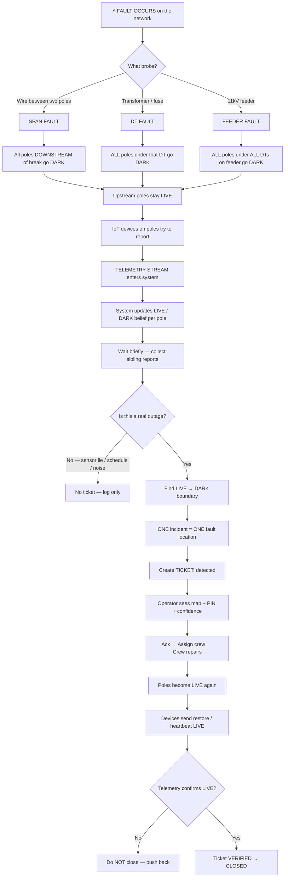

---

## 2. Physical world: what a span fault looks like

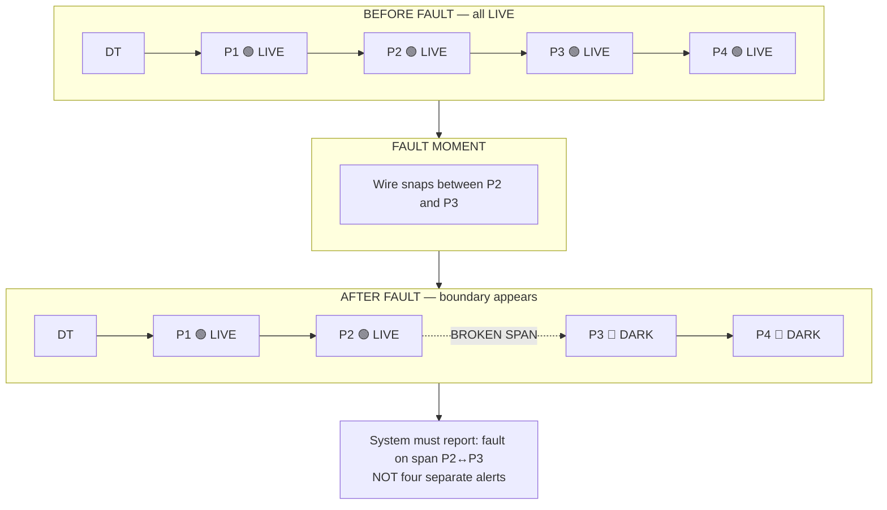

---

## 3. How LIVE / DARK gets into software (telemetry path)

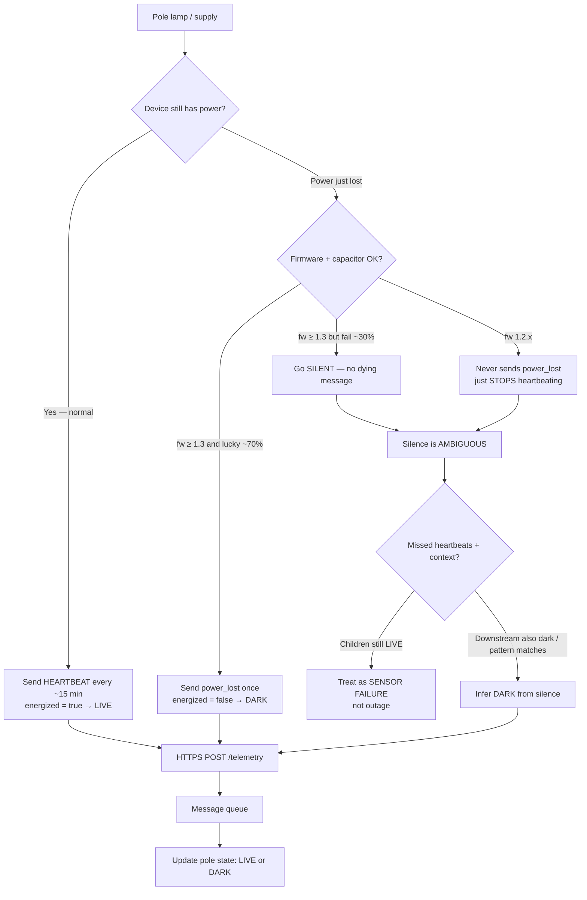

---

## 4. Messy telemetry reality (same fault, ugly arrival)

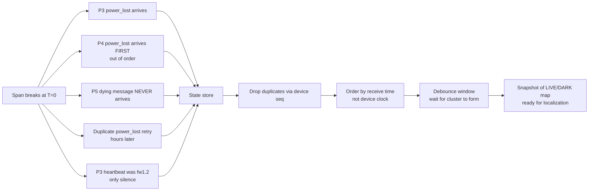

---

## 5. From dark poles → one fault location

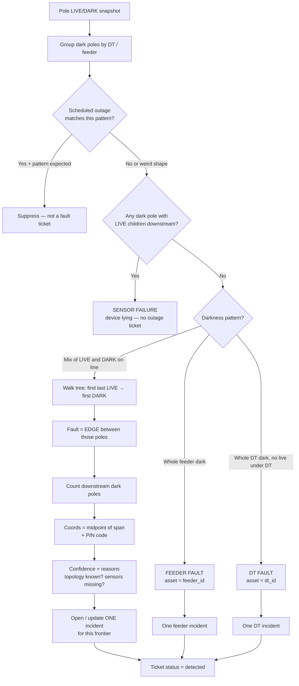

---

## 6. Multiple faults at once (storm day)

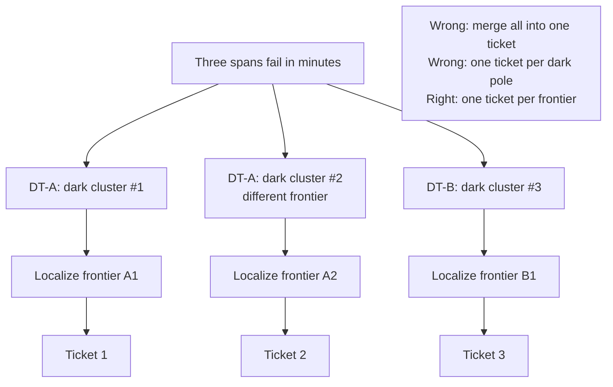

---

## 7. Missing topology branch (60% of DTs)

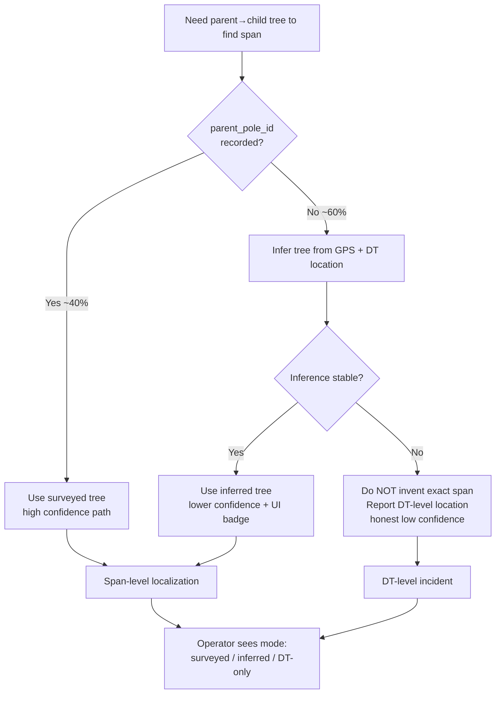

---

## 8. Ticket lifecycle + restoration verify

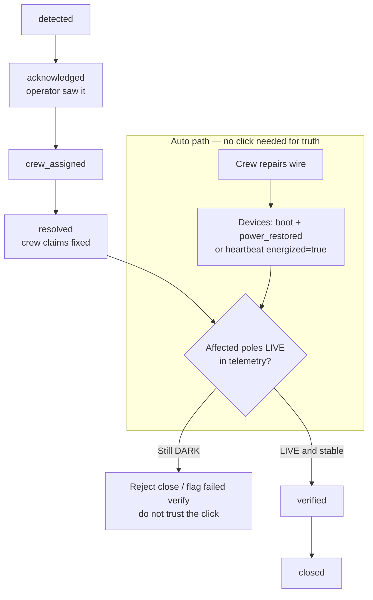

---

## 9. Operator console flow (what human does)

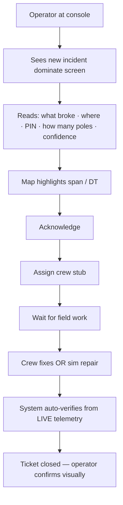

---

## 10. Simulator = same path as real world

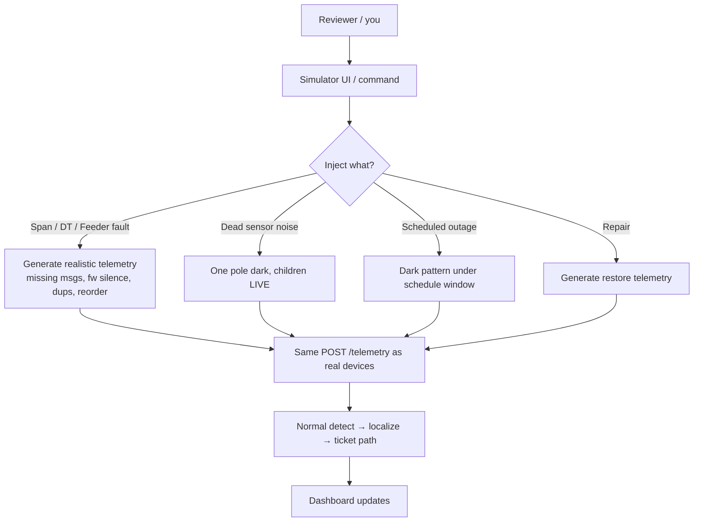

---

## 11. End-to-end swimlane (who does what)

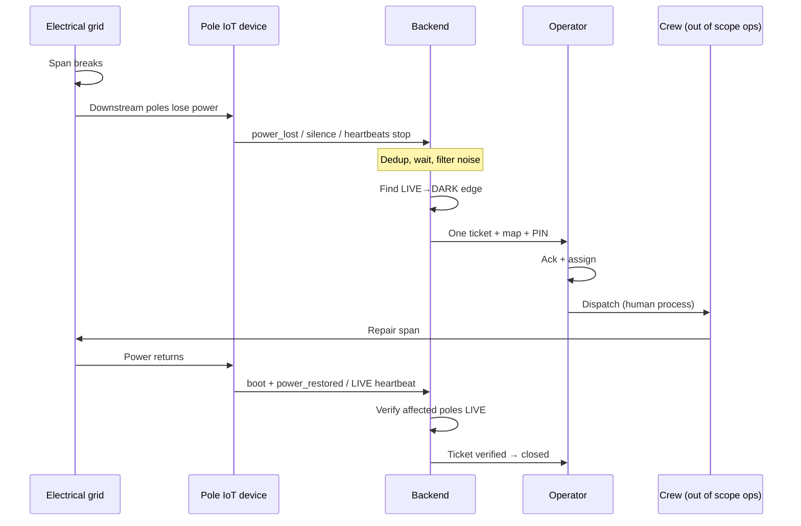

---

## 12. Decision cheat-sheet (quick)

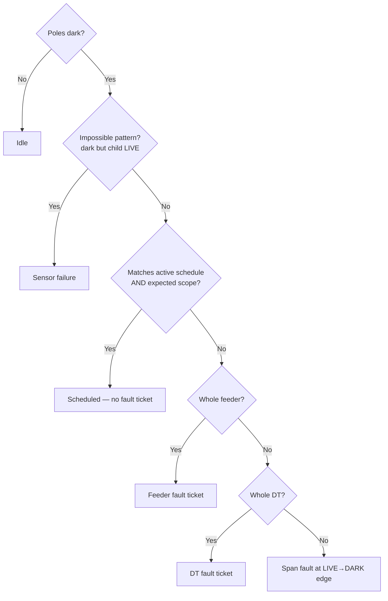

---

*When implementing, this file is the story; `ARCHITECTURE.md` is the machinery.*
