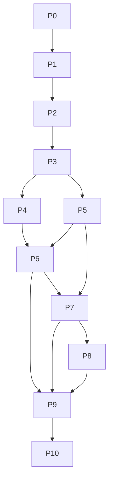

# PLAN — 15–20 hour build

**Goal:** Ship a complete, explainable core — not a wide unfinished product.  
**Budget:** 15–20 hours actual work. If approaching 40h, cut and document.  
**Architecture source of truth:** `ARCHITECTURE.md`.

---

## Principles for the build

1. **Localization first.** 25% of score. Tests before polish.
2. **Simulator is the product’s proof.** Build it early enough to drive the pipeline.
3. **Docker + seed before cosmetics.** Gates G2/G3 kill unscored work.
4. **Docs as you go.** Append `DECISIONS.md` when you choose; don’t reverse-engineer at hour 19.
5. **Cut order if late:** LLM summary → fancy map styling → SSE → extra severity features. **Never cut:** localize, group, verify, sim, docker, public URL, demo video.

---

## Hour budget (suggested)

| Phase | Hours | Outcome |
|------:|------:|---------|
| P0 Scaffold + data model | 1.5 | Compose skeleton, schema, empty apps boot |
| P1 Synthetic network + topology | 2.5 | Seeded graph; 60% inferred; known trees work |
| P2 Ingest + state + dedup | 2.0 | `/telemetry` → Redis → Postgres state |
| P3 Localization + pytest | 3.5 | Span/DT/feeder/sensor; grouping; confidence |
| P4 Noise filters + schedule | 1.5 | No cry-wolf on schedule / dead sensor |
| P5 Tickets + restore verify | 2.0 | Full FSM; telemetry closes loop |
| P6 Simulator API + UI controls | 2.0 | Reviewer can inject/repair/noise |
| P7 Operator console | 2.5 | Map + list + confidence + actions |
| P8 LLM summary (optional path) | 1.0 | Grounded text; degrades without key |
| P9 Docker harden + deploy + video | 2.0 | G1–G6 green |
| P10 Docs pass | 1.5 | Five root markdowns match reality |
| **Total** | **~21** | Trim P8 / UI chrome if over |

Buffer: steal from P7/P8 first. Never steal from P3/P5/P9.

---

## Phase details

### P0 — Scaffold (1.5h)

**Build**
- Monorepo layout:
  ```
  /backend   FastAPI + worker
  /frontend  Vite React TS
  /docker    compose, Dockerfiles
  ```
- `docker-compose.yml`: postgres, redis, api, worker, web
- `.env.example`
- Health endpoints
- Alembic or SQLAlchemy `create_all` on startup (no manual migrate step for reviewers)

**Done when:** `docker compose up` starts empty stack; `/health` 200.

**Cut if late:** Separate worker process — run consumer in same API process with asyncio (document tradeoff).

---

### P1 — Synthetic network + topology (2.5h)

**Build**
- Generator: ~3–5k poles, ~40–60 DTs, ~4 feeders worth of shape
- Proportions: ~9% no device, ~60% DTs missing parent/seq, mixed fw 1.2 / ≥1.3
- Seed on startup if DB empty
- Topology builder:
  - recorded edges where present
  - geo-infer for missing; persist `topology_source`
- In-memory adjacency cache per `dt_id`

**Done when:** DB has realistic network; can dump one DT tree; inferred vs recorded flagged.

**Tests:** generator invariants (radial, one parent, coverage ratios ±tolerance).

---

### P2 — Ingest + state (2.0h)

**Build**
- `POST /telemetry` → validate → Redis `XADD` → 202
- Worker: `XREADGROUP` → dedup `(device_id, seq)` → update `device_state`
- Stale event gate: reject seq≤last_seq; optionally reject very old recv after restore
- Heartbeat updates `last_seen_at` + energized

**Done when:** burst script 5k messages; no loss; state table coherent.

**Measure:** msg/s; note in DECISIONS.

---

### P3 — Localization engine + tests (3.5h) ← critical path

**Build**
- Debounced detector: mark DT dirty on state change; after window, run localizer
- Classes: `span_fault`, `dt_fault`, `feeder_fault`, `sensor_failure` (no outage ticket)
- Grouping by shared frontier
- Multi-fault: two frontiers → two incidents
- Confidence + `reasons[]`
- PIN resolution helper

**Tests (non-negotiable)**
| Fixture | Expect |
|---------|--------|
| Known topology span cut | Exact edge |
| DT total dark | `dt_fault` |
| Two DTs on feeder dark | `feeder_fault` |
| Dark parent, live child | `sensor_failure`, 0 outage tickets |
| Two spans same DT | 2 incidents |
| Inferred-topology span | Correct or DT-level + low confidence documented |
| Many dark poles one span | **Exactly 1** incident |

**Done when:** pytest green on above; no UI required yet (assert via API/DB).

---

### P4 — Noise + schedule (1.5h)

**Build**
- Mock scheduled outages seed + API
- Soft suppress: schedule match + pattern match; unexpected shape still tickets
- Device offline / silence policy by firmware
- Debounce constants as named config

**Done when:** self-check items “killed device / scheduled outage → no fault ticket” pass via sim commands.

---

### P5 — Ticket FSM + verify (2.0h)

**Build**
- States: detected → acknowledged → crew_assigned → resolved → verified → closed
- Operator actions via API
- Resolve while dark → verification failed / bounce with reason
- Restore telemetry → auto verified → closed
- Stability window (~30s live) optional if time

**Done when:** sim repair closes ticket without resolve click; false resolve blocked.

---

### P6 — Simulator (2.0h)

**Build**
- `POST /sim/faults` `{type, target}` → emits realistic telemetry (70% power_lost, fw1.2 silence, jitter, optional duplicates)
- `POST /sim/faults/{id}/repair`
- `POST /sim/noise` `{kind: dead_sensor|duplicate|reorder|schedule}`
- UI panel OR documented CLI one-liner — **UI preferred for reviewers**

**Done when:** stranger can inject span fault from public URL and see one ticket.

---

### P7 — Operator console (2.5h)

**Build**
- Layout: incident list (dominant) + map + detail drawer
- Show: asset, coords, PIN, affected count, confidence, reasons, ticket actions
- Topology mode badge: surveyed / inferred / DT-level
- Poll 3–5s
- Simulator controls embedded (reviewer UX)

**Done when:** 2 a.m. story works without reading docs.

**Deliberately skip:** auth UI, charts, dark-theme fetish, card spam.

---

### P8 — LLM summary (1.0h)

**Build**
- After incident create: async call with structured JSON only
- Store `summary_text`; UI collapsible
- No key → skip; show reasons

**Done when:** with key, paragraph appears; without key, core intact.

**Cut entire phase if behind** — argue “no LLM” briefly in ARCHITECTURE only if you cut *and* write the argument. Prefer shipping grounded summary if ≤1h.

---

### P9 — Deploy + video (2.0h)

**Build**
- Harden compose (healthchecks, depends_on, seed idempotent)
- Deploy public URL (Railway/Render/Fly)
- Cold-start note in README
- 5-min Loom/YouTube: inject → detect → localize → ticket → repair → auto-verify
- Fresh-clone self-test on your machine

**Done when:** G1–G6 checklist ticked.

---

### P10 — Documentation pass (1.5h)

**Required root files**
| File | Focus |
|------|--------|
| `README.md` | Run, URL, video, doc map |
| `ARCHITECTURE.md` | Already drafted — trim to match **shipped** code |
| `DEPLOYMENT.md` | Copy-paste + troubleshooting you actually hit |
| `DECISIONS.md` | Newest first; assumptions; what you’d do in 2 more weeks |
| `AI-WORKFLOW.md` | Tools, rejects, % estimate, best prompts |

**Done when:** stranger can run from README alone; diagram matches code.

---

## Dependency graph



P3 blocks almost everything valuable. Do not parallelize UI before P3 is green.

---

## Daily rhythm (7 calendar days)

| Day | Focus |
|----:|-------|
| 1 | P0–P2 |
| 2 | P3 solid + tests |
| 3 | P4–P5 |
| 4 | P6 + start P7 |
| 5 | P7 finish + P8 |
| 6 | P9 deploy + video |
| 7 | P10 docs + self-check + submit buffer |

---

## Risk register

| Risk | Mitigation |
|------|------------|
| Inferred topology wrong in demos | Demo on a **recorded-topology** DT first; show inferred case second with badge |
| Free host cold start looks “broken” | README wait note; video as insurance (G6) |
| WebSocket fails on host | Never depend on WS; polling only |
| Scope creep (auth, analytics) | Cut list above; DECISIONS “won’t do” |
| AI-written code you can’t explain | After each phase, re-read localization + ingest yourself |
| Perf claims without measurement | 30-min bench script in P2/P9; write real numbers |

---

## Definition of “shippable”

All of the following true:

1. `docker compose up` → seeded UI
2. Public URL works logged-out
3. Span inject → **one** correct ticket + PIN
4. Triple inject → three tickets
5. Dead sensor → no outage ticket
6. Schedule → no outage ticket
7. Repair → auto-verify
8. False resolve → rejected
9. Five docs present and honest
10. You can explain every file on a call

Then stop adding features.
