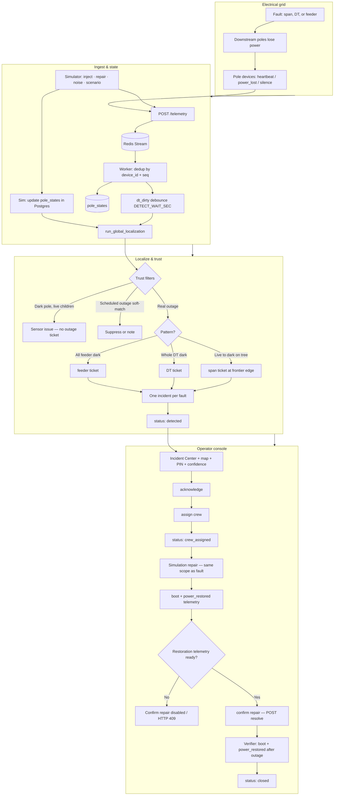

# GridLocalizer

This is a small control-room app for a radial low-tension distribution network. Poles only tell us **live** or **dark**. The backend figures out *where* the fault likely is (span, distribution transformer, or feeder), opens **one ticket per real outage**, and only closes that ticket after **restore telemetry** checks out.

| | |
|---|---|
| **Live app** | https://gridlocalizer.vercel.app |
| **Demo video** | https://www.loom.com/share/2e9c151eef86404ebd19678d7fe4e5dc |
| **Repo** | https://github.com/AyushSid28/GridLocalizer |

**Reviewers:** No third-party API keys are required. The full fault → ticket → repair flow runs with `docker compose up --build` only.

The app runs on free-tier hosting, so the first load can take up to a minute if you see “Waking up…” in the header. That is normal — give it a moment rather than assuming it is down.

---

## How it fits together

Editable diagram (Mermaid Chart): [architecture flow](https://mermaid.ai/app/projects/c8a88bf0-6185-46de-8264-3d9d3631bdc5/diagrams/24a90605-4b73-4d7b-b8c4-d24d10c8e364/version/v0.1/edit). Source in repo: [docs/SYSTEM_FLOW.md](docs/SYSTEM_FLOW.md).



Telemetry from the grid (or the built-in simulator) flows through ingest and state, then localization and trust rules, and lands in the operator console. Full design: [docs/ARCHITECTURE.md](docs/ARCHITECTURE.md).

---

## Run it locally

```bash
git clone https://github.com/AyushSid28/GridLocalizer.git
cd GridLocalizer
docker compose up --build
```

| What | URL |
|------|-----|
| Operator console | http://localhost:3000 |
| API health | http://localhost:8000/health |
| OpenAPI | http://localhost:8000/docs |

On first boot the stack seeds a synthetic network (thousands of poles) so you are not staring at an empty screen.

---

## Try a DT outage in the UI

1. Open **Simulation** → **Outage Injection** → choose **DT**, pick a transformer, and click **Inject**.
2. Wait for **one** ticket in Incident Center (a short debounce groups sibling pole reports).
3. **Acknowledge**, then **Assign crew**.
4. **Repair** the **same DT** so restore telemetry is published.
5. When the UI shows restoration telemetry is ready, **Confirm repair** to close the ticket.

**Several faults at once:** use the multifault selector — each DT gets its own ticket; same steps per ticket.

**Noise:** inject a dead sensor on a pole. You should see a false-alarm style signal, not a full outage ticket.

---

## Documentation

| File | Contents |
|------|----------|
| [docs/ARCHITECTURE.md](docs/ARCHITECTURE.md) | System design, localization, APIs, ticket lifecycle |
| [docs/DEPLOYMENT.md](docs/DEPLOYMENT.md) | Env vars, run locally, troubleshooting, deploy |
| [docs/DECISIONS.md](docs/DECISIONS.md) | Trade-offs and assumptions |
| [docs/AI-WORKFLOW.md](docs/AI-WORKFLOW.md) | How AI was used while building |

---

## Stack

FastAPI · Redis Streams · PostgreSQL · React/Vite · Docker Compose

Optional **Explain incident** uses Groq or OpenAI if you set `GROQ_API_KEY` or `OPENAI_API_KEY`. Without a key, you still get a deterministic summary from the same facts. The LLM is never used to localize faults.
