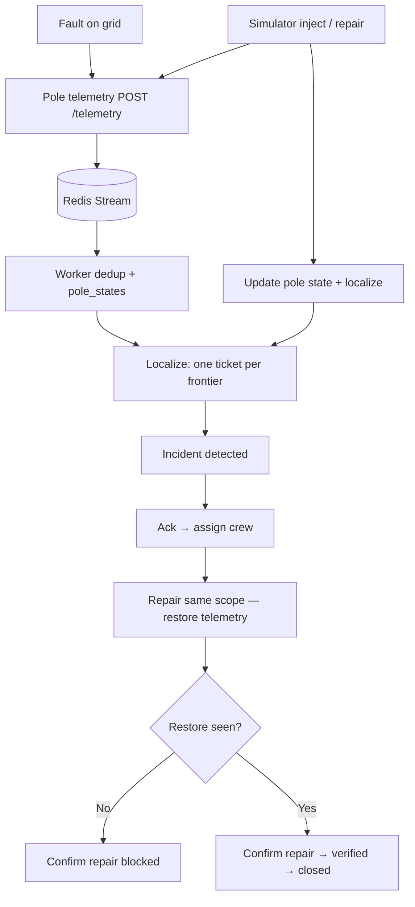

# Architecture

**Stack:** FastAPI, Redis Streams, PostgreSQL, React/Vite, Docker Compose.

**Goal:** Turn noisy pole telemetry (live/dark only) into one trustworthy localized incident per real outage, and close tickets only when restore telemetry agrees.

---

## End-to-end data flow

Editable copy: [Mermaid Chart](https://mermaid.ai/app/projects/c8a88bf0-6185-46de-8264-3d9d3631bdc5/diagrams/24a90605-4b73-4d7b-b8c4-d24d10c8e364/version/v0.1/edit) · [SYSTEM_FLOW.md](SYSTEM_FLOW.md).

The simulator and real devices share the same **telemetry ingest path**. The worker absorbs bursts; simulator inject also updates Postgres and runs localization so the demo feels responsive without bypassing production logic.

In a real deployment, devices would likely publish over NB-IoT → MQTT → a bridge into this stream. For the assignment we use HTTPS for simplicity.

---

## Ingestion

- `POST /telemetry` validates the payload, appends to a Redis stream (`XADD`), and returns **202** quickly.
- The worker deduplicates on `(device_id, seq)` and keeps per-device ordering sane.
- Device clocks can skew by about ±90 seconds. We order on **server receive time**, not the device timestamp.
- Firmware 1.2.x never sends an explicit `power_lost`; loss is inferred from missed heartbeats after silence rules in the brief.
- Late retries hours later are dropped when `seq` is already stale.

---

## Storage and topology model

| Table | Role |
|-------|------|
| `feeders` / `distribution_transformers` / `poles` | Asset registry |
| `pole_states` | Current energized belief per pole |
| `incidents` | Tickets, confidence, structured reasons |
| `scheduled_outages` | Soft suppress signal (never a hard block) |
| `processed_events` | Dedup ledger |

Each pole carries:

- **`parent_id`** — tree edge the **localizer** walks (recorded or geo-inferred).
- **`true_parent_id`** — ground truth for the **simulator** when wiring was inferred in the registry.
- **`topology_source`** — `recorded` | `inferred` | `none`.

Adjacency for a DT is cached in memory (`topo_index`) so repeated localization stays cheap.

**Why a radial tree?** The brief describes an LT radial network. Faults are edges between live and dark; walking parent pointers from a DT root matches how crews think about “upstream vs downstream.”

**Missing topology (~60% of DTs):** At seed time we clear registry parents for those DTs, then grow a tree from the DT using nearest-neighbour geography. The UI and confidence scores show when wiring is inferred. If the whole DT subtree is dark, we report a **DT** fault instead of inventing a precise span on bad geometry.

---

## Localization algorithm

Treat sensors as nodes and faults as cuts on the radial tree. Find the **live → dark frontier**.

1. **Debounce** dirty DTs for `DETECT_WAIT_SEC` (10s on Render by default) so sibling poles can report before we ticket.
2. **Scheduled outages** — soft check only; late or cancelled feeds must not hide a real fault.
3. **Sensor lie:** a dark pole with live descendants → sensor failure, not an outage ticket.
4. **Classify:**
   - all DTs on a feeder dark → `feeder`
   - entire DT dark → `dt`
   - otherwise → `span` at last live parent → first dark child
5. **Group** all dark poles that share the same frontier into **one** incident.
6. Two distinct frontiers on the same DT → **two** incidents (multifault).
7. **Confidence** is deterministic from wiring quality, missing devices, and class. Reasons are stored as structured evidence for the UI and explain endpoint.
8. **PIN:** use the pole registry when present; else nearest pole with a PIN for map context.

**Complexity:** O(n) per dirty DT where n is poles under that DT (on the order of a few hundred in the seed).

**Known failure modes:** wrong parent when geo-infer picks a neighbour in a dense cluster; debounce adds intentional delay; partial device coverage can blur the true boundary.

Someone reimplementing this needs: frontier detection on a tree, grouping by frontier key, debounce per DT, and the degrade rules above for missing wiring.

---

## Noise and trust

| Signal | What we do |
|--------|------------|
| Duplicate or stale `seq` | Drop |
| Isolated dark pole, children still live | Treat as sensor failure |
| Schedule overlaps scope | Soft suppress (lower appetite to ticket) |
| Unexpected dark pattern during a schedule | Still ticket — schedules are untrustworthy |

**False-positive story:** We would rather wait a few seconds and group one frontier than open dozens of tickets for one wire. Isolated dark nodes without a consistent frontier do not become outage incidents.

---

## Ticket lifecycle

`detected → acknowledged → crew_assigned → resolved → verified → closed`

1. **Assign crew** — dispatch only; poles may still be dark.
2. **Simulation → Repair** (same scope as the fault) — publishes `power_restored` and `boot` on the real ingest path. That is how we simulate measured restore in the demo.
3. **Confirm repair (resolve)** — allowed only after restoration telemetry is present on affected reporting poles; otherwise the API returns **409**.
4. **Verifier** — moves to `verified` / `closed` when checks pass.

Repair does **not** auto-close tickets. Trying to resolve while the scope is still dark is rejected, not queued.

---

## API surface

| Method | Path | Purpose |
|--------|------|---------|
| GET | `/health` | Liveness |
| GET | `/health/ready` | Database check |
| POST | `/telemetry` | Ingest device event |
| GET | `/network/summary` | Seeded network counts |
| GET | `/network/dts` | DT list |
| GET | `/network/dts/{id}` | Poles and state for a DT |
| GET | `/breadcrumb/dt/{id}` | Upstream path hint |
| GET | `/incidents` | Incident list |
| POST | `/incidents/{id}/acknowledge` | Acknowledge |
| POST | `/incidents/{id}/assign_crew` | Assign stub crew |
| POST | `/incidents/{id}/resolve` | Operator confirms fix (telemetry-gated) |
| POST | `/incidents/{id}/explain` | Grounded natural-language summary |
| POST | `/sim/inject` | Inject span / DT / feeder fault |
| POST | `/sim/repair` | Emit restore telemetry |
| POST | `/sim/noise` | Dead sensor / duplicate / reorder |
| POST | `/sim/scenario` | Packaged demo scenario |

Request and response shapes are in **OpenAPI** at `/docs` (generated by FastAPI — prefer that over hand-maintained copies).

---

## Operator UI

**What you see first:** open incidents — what failed, where, and how confident we are. Map and detail panels support triage; simulator controls sit on the same screen so reviewers can run the full story without switching tools.

**Deliberately omitted:** authentication, crew routing optimization, analytics dashboards, and per-pole alert floods.

**Realtime:** short polling instead of WebSockets — fewer surprises behind free-tier reverse proxies.

**What might be wrong:** polling feels a step behind a live SCADA wallboard; geo-inferred spans can look precise when they are not. We surface topology source and confidence so operators can push back.

---

## AI feature

**Grounded incident explanation** on `POST /incidents/{id}/explain`.

- Inputs are structured incident fields and reasons only — no free-form grid dump.
- Tries Groq, then OpenAI; if no key or the call fails, returns a deterministic paragraph from the same facts.
- **Not** used for localization, confidence, or grouping.

**Cost:** one short chat completion per explain click. **Unavailable model:** core product still works; explain falls back to the template.

---
