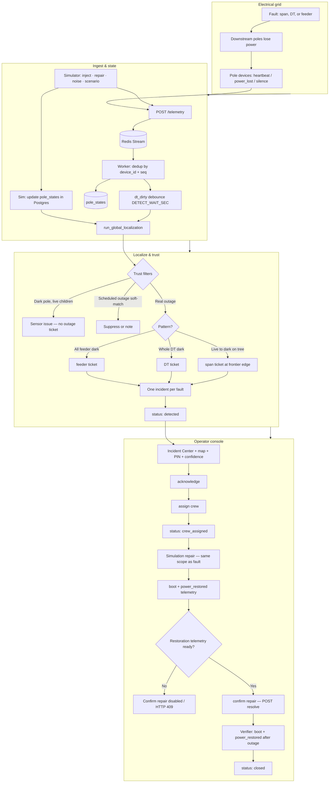

# GridLocalizer — main system flow (Mermaid source)

Editable source for the diagram in the [README](../README.md) and [ARCHITECTURE.md](ARCHITECTURE.md).

**Mermaid Chart (edit online):** https://mermaid.ai/app/projects/c8a88bf0-6185-46de-8264-3d9d3631bdc5/diagrams/24a90605-4b73-4d7b-b8c4-d24d10c8e364/version/v0.1/edit

Committed diagram: `images/system-flow.svg` (export from Mermaid Chart).

---

## Main flow — fault to closed ticket

---

**Live demo:** https://gridlocalizer.vercel.app  
**Video:** https://www.loom.com/share/2e9c151eef86404ebd19678d7fe4e5dc
